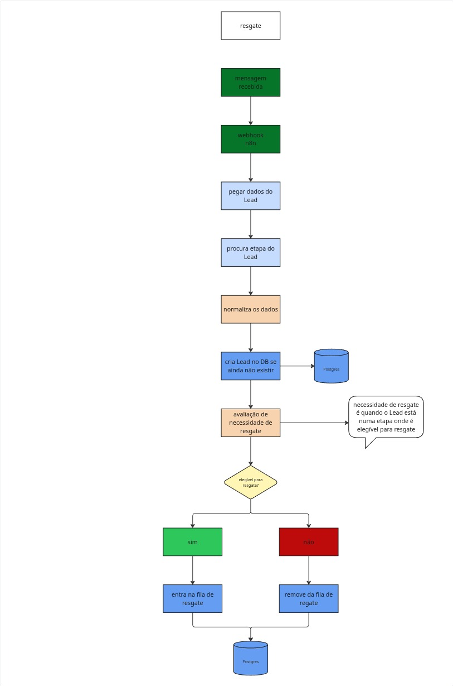

## Automação de captação e verificação de resgate

Este fluxo do n8n recebe eventos enviados pelo Kommo, reconstrói o estado atual do lead, verifica se ele atende às regras de resgate e registra os leads elegíveis em uma fila PostgreSQL. A automação também grava um histórico de auditoria e marca o lead no Kommo com tags de resgate pendente.

Este workflow corresponde à primeira parte do processo. A execução dos resgates já agendados é realizada pelo fluxo documentado em [`/docs/executa_resgate.md`](./executa_resgate.md).

### Tabelas usadas

* `public.rescue_queue` — fila operacional dos leads elegíveis. Cada registro armazena o lead, pipeline, status, tipo de resgate, intervalo de espera, limite de tentativas, datas de execução, estado da fila e o snapshot da última mensagem.

* `public.rescue_history` — histórico de auditoria das decisões de captação. Registra inclusões na fila e bloqueios, com a chave da fila, lead, tentativa, ação, resultado, detalhes e data do evento.

O próprio fluxo cria as tabelas e os índices necessários caso ainda não existam. A segunda parte do processo pode complementar a estrutura dessas tabelas com colunas adicionais usadas durante execução, reagendamento e cancelamento.

### Configurações protegidas

O JSON higienizado não contém tokens, subdomínios reais, IDs internos do workflow, IDs de webhook, IDs de nós ou referências reais de credenciais.

Antes de ativar a automação, substitua os seguintes placeholders:

* `SUBDOMINIO_DA_CONTA_KOMMO` — subdomínio da conta utilizada nas URLs do Kommo.

* `ACCESS_TOKEN_DO_KOMMO` — token de acesso usado nos headers `Authorization` das requisições à API.

* `ID_DA_CREDENCIAL_POSTGRES` — identificador da credencial PostgreSQL cadastrada no n8n.

* `NOME_DA_CREDENCIAL_POSTGRES` — nome da credencial PostgreSQL cadastrada no n8n.

O nó de atualização do lead também aceita a variável de ambiente `KOMMO_BASE_URL`. Quando ela não estiver definida, o fluxo utiliza a URL de fallback com `SUBDOMINIO_DA_CONTA_KOMMO`.

### Como funciona

1. O webhook recebe uma requisição `POST` no caminho `resgate`.

2. O payload é normalizado para reconhecer eventos de mensagem, alteração de status, criação ou atualização de lead e criação ou atualização de contato.

3. O processamento principal continua somente quando o evento normalizado possui um `lead_id`. Eventos exclusivamente de contato, sem lead associado no payload, encerram nesse ponto.

4. O fluxo consulta na API do Kommo os dados atuais do lead e os status do pipeline correspondente.

5. O estado do lead é reconstruído com o pipeline, status, etapa, tags e sinais de encerramento. Quando o evento contém uma mensagem, também são capturados o ID, a data, o ator e um hash do conteúdo para formar o snapshot da conversa.

6. As tabelas `public.rescue_queue` e `public.rescue_history` e seus índices são criados ou atualizados antes da avaliação do resgate.

7. O lead é bloqueado quando está fechado, não possui etapa identificável, está em atendimento humano, já possui tags de resgate pendente, em execução ou cancelado, ou não corresponde a uma etapa elegível.

8. As etapas elegíveis são classificadas por palavras-chave em quatro tipos:

   * `consulta` — espera de 24 horas e até 2 tentativas;
   * `orcamento` — espera de 72 horas e até 3 tentativas;
   * `crediario` — espera de 48 horas e até 2 tentativas;
   * `duvidas` — espera de 24 horas e até 2 tentativas.

9. Para um lead elegível, a chave da fila é formada por `lead_id`, tipo de resgate e status. A data `execute_at` é calculada com base no intervalo do tipo de resgate.

10. A data `not_before_at` recebe o maior valor entre `execute_at` e 72 horas após a última mensagem conhecida. Isso impede que o resgate seja executado antes da janela mínima de silêncio.

11. O registro é inserido ou atualizado em `public.rescue_queue` com estado `pending` e tentativa inicial igual a zero. A inclusão também é registrada em `public.rescue_history` com a ação `queued`.

12. O lead é atualizado no Kommo com as tags de resgate pendente. Essa requisição está configurada com `continueOnFail`, portanto uma falha na aplicação das tags não desfaz automaticamente os registros já gravados no PostgreSQL.

13. Quando o lead não é elegível, o fluxo registra em `public.rescue_history` uma ação `skip`, com resultado `blocked` e o motivo do bloqueio.

### Webhooks

O fluxo utiliza um webhook `POST` com o caminho configurado como `resgate`.

O payload normalizado reconhece os seguintes eventos do Kommo:

* `message[add]`;
* `leads[status]`;
* `leads[add]`;
* `leads[update]`;
* `contacts[add]`;
* `contacts[update]`.

Somente eventos que resultem em um `lead_id` seguem para as consultas e para a avaliação de resgate.

### Integrações

* **Kommo** — consulta dados do lead e dos status do pipeline e aplica tags ao lead elegível.

* **PostgreSQL** — mantém a fila operacional e o histórico de auditoria compartilhados com o fluxo de execução.

### Tags aplicadas

Quando o lead é adicionado à fila, o fluxo pode aplicar:

* `RESGATE_PENDENTE`;

* `RESGATE_PENDENTE_<TIPO>`.

O sufixo `<TIPO>` é gerado a partir do tipo de resgate, por exemplo `CONSULTA`, `ORCAMENTO`, `CREDIARIO` ou `DUVIDAS`.

Na etapa de captação, o fluxo não configura tags para remoção.

### Visualização do fluxo

### Documentação relacionada

Consulte [`/docs/executa_resgate.md`](./executa_resgate.md) para entender a segunda parte do processo, responsável por consumir a fila, revalidar o estado do lead e decidir entre executar, reagendar ou cancelar o resgate.

### Observações

O JSON é entregue com o workflow desativado. Depois da importação, vincule a credencial correta do PostgreSQL, substitua o subdomínio e o token do Kommo, confira a URL base e execute testes controlados antes de ativar o webhook em produção.

O arquivo de origem continha um token de acesso em texto. Essa credencial deve ser revogada ou rotacionada, mesmo após a geração da versão censurada.

A versão higienizada remove os identificadores internos do n8n e corrige duas inconsistências evidentes do material original:

* a detecção de lead fechado agora avalia `is_deleted`, `closed_at` e o nome da etapa com operadores OR, evitando que um valor `false` em `is_deleted` impeça as demais verificações;

* os headers de autorização utilizam o formato `Bearer ACCESS_TOKEN_DO_KOMMO`, sem o caractere `=` que antecedia o prefixo no material original.

O fluxo é orientado a eventos e não possui agendamento próprio. Os horários usados em `Date`, `NOW()`, `execute_at` e `not_before_at` dependem do relógio e do fuso configurados na instância do n8n e no PostgreSQL.
