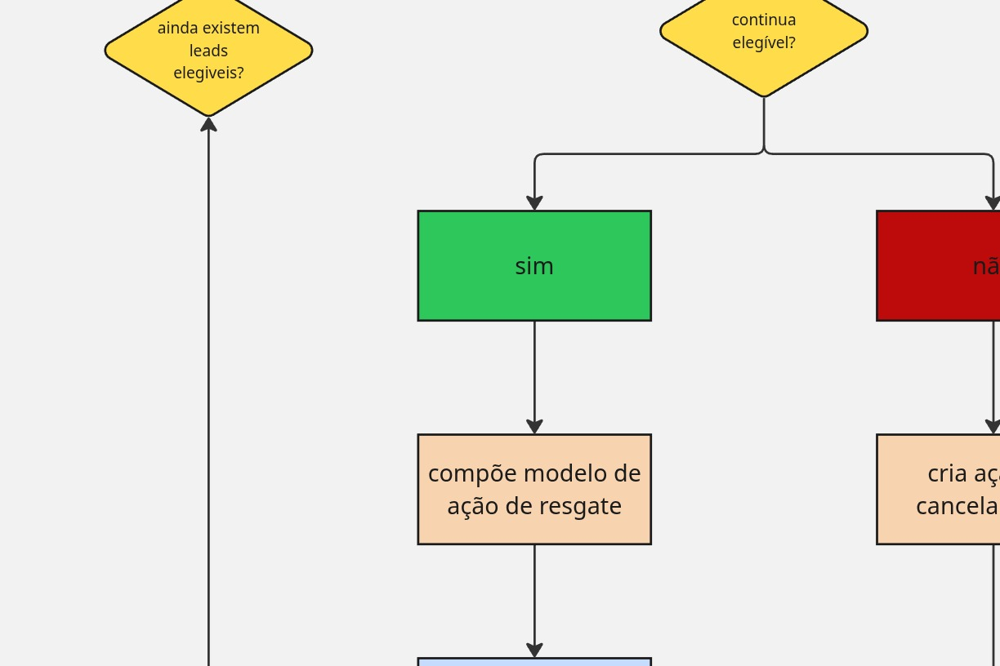

## Automação de execução de resgate

Este fluxo do n8n processa resgates pendentes de leads integrados ao Kommo. Ele consulta a fila de resgate no PostgreSQL, reconstrói o estado atual do lead, valida se o resgate ainda pode ser executado e decide entre executar, reagendar ou cancelar.

### Tabelas usadas

* `public.rescue_queue` — fila operacional na qual os leads elegíveis são adicionados para processamento. Cada registro controla o tipo de resgate, a data prevista de execução, a quantidade de tentativas, o estado atual e o snapshot usado nas validações.

* `public.rescue_history` — histórico de auditoria das decisões tomadas pelo fluxo, incluindo execuções, reagendamentos e cancelamentos.

Os leads são adicionados à tabela `public.rescue_queue` pelo fluxo de captação descrito em [`docs/captarResgate.md`](./captarResgate.md). Esta automação não faz a captação inicial: ela lê os leads já registrados na tabela e executa o tratamento da fila.

### Configurações protegidas

O arquivo JSON foi higienizado e não contém credenciais, tokens, domínios reais, IDs de credenciais, IDs de instância ou IDs internos do workflow.

Antes de ativar a automação, substitua os seguintes placeholders:

* `SEU_SUBDOMINIO_KOMMO` — subdomínio da conta do Kommo

* `SEU_ACCESS_TOKEN_KOMMO` — token de acesso usado nas requisições à API

* `CREDENCIAL_POSTGRES_ID` — identificador da credencial PostgreSQL no n8n

* `CREDENCIAL_DO_POSTGRES` — nome da credencial PostgreSQL no n8n

### Como funciona

1. O gatilho executa o fluxo a cada hora.

2. O fluxo verifica se o horário atual está entre 7h e 21h. Essa validação usa o fuso horário configurado no servidor ou na instância do n8n.

3. As tabelas `public.rescue_queue` e `public.rescue_history` são criadas ou atualizadas, caso ainda não existam com a estrutura esperada.

4. O fluxo busca até 100 leads pendentes cuja data de execução já venceu e que ainda não atingiram o limite máximo de tentativas.

5. Para cada lead da fila, a automação consulta no Kommo os dados atuais do lead e os status do pipeline.

6. O estado atual é comparado com o snapshot salvo na fila, incluindo etapa, status, última mensagem, ator da mensagem, tags e sinais de atendimento humano.

7. O resgate é cancelado quando o lead está fechado, foi assumido por atendimento humano, já foi concluído ou cancelado, mudou de etapa ou pipeline, não possui a última mensagem necessária ou deixou de atender aos critérios.

8. O resgate é reagendado quando ainda não passaram 72 horas desde a última mensagem ou quando o snapshot da conversa mudou. A nova data é gravada novamente em `public.rescue_queue`, e a decisão também é registrada em `public.rescue_history`.

9. Quando todas as validações são aprovadas, o fluxo marca o lead no Kommo com tags de execução e tentativa, registra o disparo no histórico e atualiza a fila. Caso ainda existam tentativas disponíveis, uma nova execução é programada conforme `wait_hours`; caso contrário, o registro passa para o estado `exhausted`.

10. Após cada execução, reagendamento ou cancelamento, o fluxo retorna ao processamento em lote até concluir os itens selecionados.

### Tags aplicadas

Durante a execução, podem ser aplicadas tags como:

* `RESGATE_EM_EXECUCAO`

* `RESGATE_EM_EXECUCAO_<TIPO>`

* `RESGATE_TENTATIVA_<NUMERO>`

Durante o cancelamento, podem ser aplicadas tags como:

* `RESGATE_CANCELADO`

* `RESGATE_CANCELADO_<TIPO>`

As tags pendentes correspondentes são removidas conforme a decisão tomada.

### Visualização do fluxo

### Documentação relacionada

Consulte [`docs/captarResgate.md`](./captarResgate.md) para entender o fluxo responsável por identificar os leads elegíveis e adicioná-los à tabela `public.rescue_queue`.

### Observações

O JSON é entregue com o workflow desativado por segurança. Depois da importação, vincule a credencial correta do PostgreSQL, substitua o subdomínio e o token do Kommo, confira o fuso horário da instância e execute testes controlados antes de ativar o agendamento.

A versão higienizada também corrige a comparação de mudança de pipeline e configura explicitamente a condição de reagendamento, que estavam inconsistentes no material original.
