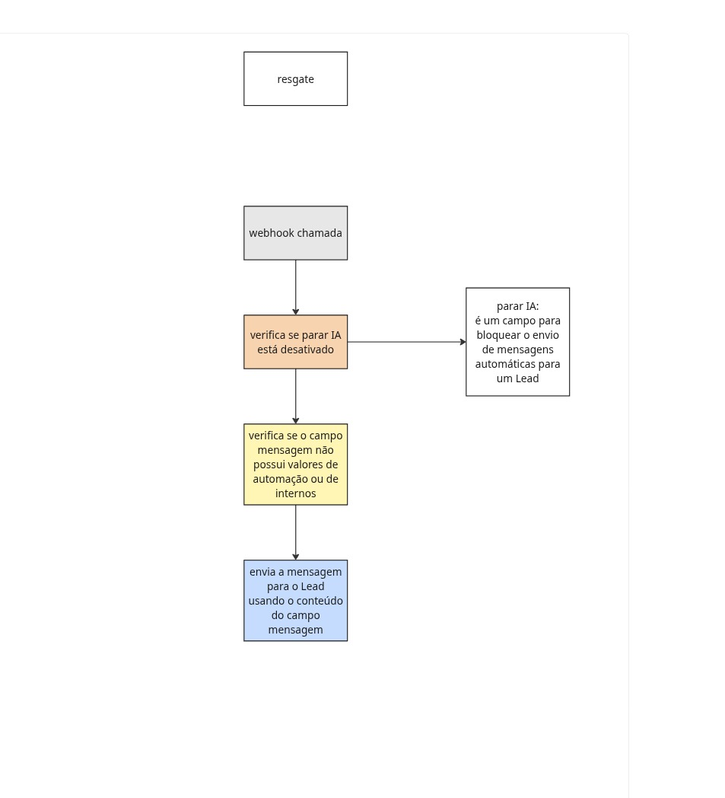

## Salesbot de disparo por campo

Este bloco do Kommo funciona como um disparador controlado por campos do lead, usado para disparar mensagens por fluxos externos ao Kommo.

### Campos usados

- `MENSAGEM_IA` — campo de texto com a mensagem que será enviada

- `PARAR_IA` — interruptor que bloqueia o disparo quando estiver ativado

### Como funciona

1. O bot verifica se `PARAR_IA` está desativado.

2. Em seguida valida se o conteúdo de `MENSAGEM_IA` é uma mensagem válida e não texto interno de automação.

3. Se passar nas validações, o bot envia o conteúdo de `MENSAGEM_IA` como mensagem externa para os contatos vinculados ao lead.

4. Se o campo indicar conteúdo técnico/interno, o fluxo encerra sem disparo.

### Visualização do fluxo

### Observação

Dependendo da instância do Kommo, pode ser necessário substituir os nomes dos campos pelos IDs reais do ambiente.